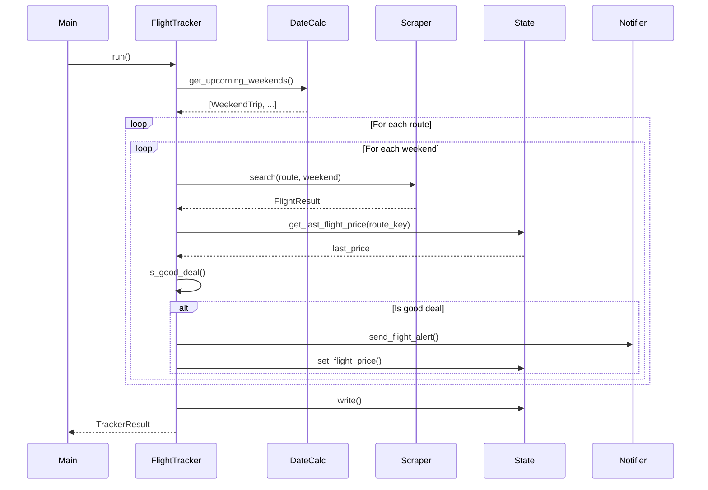
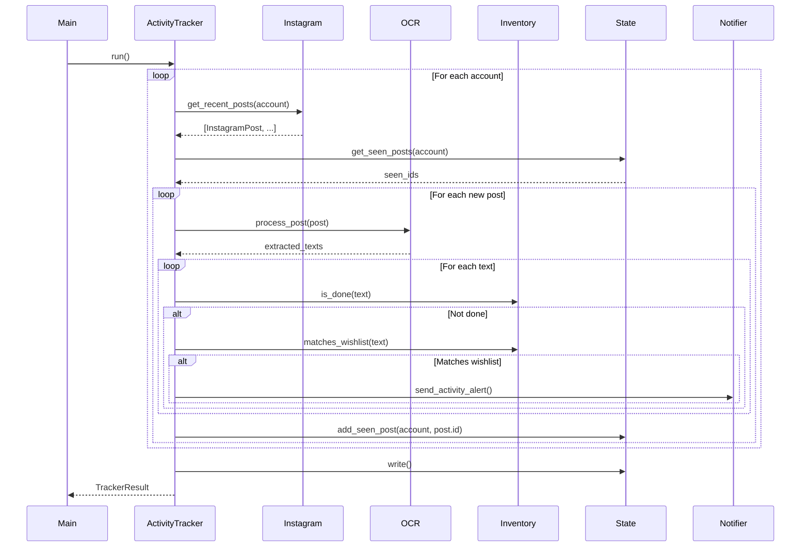

# Technical Design Document

## Introduction

This document describes the technical architecture and design decisions for the Adventure Tracker system. The design follows a modular, configuration-driven approach that enables dual execution (local and GitHub Actions) while maintaining zero-cost operations through scraping and free APIs.

## Architecture Overview

```
┌─────────────────────────────────────────────────────────────────────────────┐
│                           ADVENTURE TRACKER                                  │
├─────────────────────────────────────────────────────────────────────────────┤
│                                                                             │
│  ┌─────────────────┐  ┌─────────────────┐  ┌─────────────────┐             │
│  │     Config      │  │  State Manager  │  │   Notifier      │             │
│  │   (YAML + env)  │  │  (GitHub Gist)  │  │   (Telegram)    │             │
│  └────────┬────────┘  └────────┬────────┘  └────────┬────────┘             │
│           │                    │                    │                       │
│           ▼                    ▼                    ▼                       │
│  ┌─────────────────────────────────────────────────────────────────────┐   │
│  │                         Orchestrator (main.py)                       │   │
│  │                                                                      │   │
│  │  - Detects environment (CI vs local)                                │   │
│  │  - Coordinates tracker modules                                       │   │
│  │  - Handles global error recovery                                     │   │
│  └──────────────┬─────────────────────────────────┬────────────────────┘   │
│                 │                                 │                         │
│        ┌────────▼────────┐               ┌────────▼────────┐               │
│        │  Flight Module  │               │ Activity Module │               │
│        └────────┬────────┘               └────────┬────────┘               │
│                 │                                 │                         │
│     ┌───────────┴───────────┐         ┌──────────┴──────────┐             │
│     │                       │         │                      │             │
│  ┌──▼──────────┐  ┌─────────▼──┐   ┌──▼──────────┐  ┌───────▼────┐       │
│  │ Date Logic  │  │  Scraper   │   │  Instagram  │  │    OCR     │       │
│  │ + Holidays  │  │  (Google   │   │  Scraper    │  │  Processor │       │
│  │             │  │  Flights)  │   │             │  │            │       │
│  └─────────────┘  └────────────┘   └─────────────┘  └────────────┘       │
│                                                                            │
│  ┌─────────────────────────────────────────────────────────────────────┐  │
│  │                    Inventory Manager                                 │  │
│  │              done.yaml  │  wishlist.yaml                            │  │
│  └─────────────────────────────────────────────────────────────────────┘  │
│                                                                            │
└─────────────────────────────────────────────────────────────────────────────┘
```

## Design Decisions

### Decision 1: Modular Package Structure

**Context:** The system has distinct responsibilities (flights, activities, notifications, state) that should be independently testable and maintainable.

**Decision:** Adopt a modular package structure under `src/aventure_tracker/` with clear separation:
- `services/` - Core business logic (trackers, processors)
- `scrapers/` - Web scraping implementations (Page Object Model)
- `models/` - Data models and configuration schemas
- `infrastructure/` - External service integrations (Telegram, GitHub Gist)

**Rationale:** This structure enables:
- Independent unit testing of each module
- Clear dependency boundaries
- Easy addition of new scrapers or notification channels

### Decision 2: Configuration via Pydantic Settings

**Context:** The system needs to handle environment variables differently in local vs CI environments while maintaining type safety.

**Decision:** Use `pydantic-settings` for configuration management with a cascading priority:
1. Environment variables (highest priority)
2. `.env` file (local development)
3. Default values in code

**Rationale:** 
- Type validation at startup catches configuration errors early
- Single `Settings` class provides IDE autocompletion
- `CI=true` detection enables automatic environment switching

### Decision 3: State Persistence via GitHub Gist

**Context:** Both local and GitHub Actions runs need to share state to avoid duplicate notifications.

**Decision:** Use a secret GitHub Gist as a JSON document store, accessed via GitHub REST API.

**State Schema:**
```json
{
  "version": 1,
  "flights": {
    "BAQ-MDE-2025-03-15": {
      "last_price": 145000,
      "last_notified": "2025-03-01T10:30:00Z",
      "price_history": [150000, 148000, 145000]
    }
  },
  "instagram": {
    "brutaltravel.co": {
      "last_post_id": "ABC123",
      "last_checked": "2025-03-01T10:30:00Z"
    }
  }
}
```

**Rationale:**
- Free storage with no expiration
- Accessible from anywhere with a PAT
- JSON format is human-readable for debugging
- Single Gist avoids managing multiple storage backends

### Decision 4: Scraping Strategy with Fallbacks

**Context:** Web scraping is inherently fragile; sites change and implement anti-bot measures.

**Decision:** Implement a multi-layer scraping strategy:

1. **Google Flights:** Playwright + playwright-stealth (no alternative available)
2. **Instagram:** 
   - Primary: Instaloader library (reliable, minimal footprint)
   - Fallback: Playwright with stealth (when Instaloader fails)
   - Ultimate fallback: Notify user to check manually

**Rationale:**
- Instaloader is battle-tested and maintained by the community
- Playwright fallback provides redundancy
- Manual notification fallback ensures user awareness when automation fails

### Decision 5: Page Object Model for Scrapers

**Context:** Web page structures change frequently; scraping code becomes unmaintainable without proper abstraction.

**Decision:** Implement Page Object Model (POM) pattern for all scrapers:

```python
class GoogleFlightsPage:
    def __init__(self, page: Page):
        self._page = page
    
    async def set_route(self, origin: str, destination: str) -> None:
        ...
    
    async def search_flights(self) -> list[FlightResult]:
        ...
```

**Rationale:**
- Selector changes are isolated to one class
- Business logic remains clean and readable
- Tests can mock the page object instead of the entire browser

### Decision 6: OCR Pre-processing Pipeline

**Context:** Instagram posts contain stylized text over images; raw Tesseract results are often poor quality.

**Decision:** Implement a pre-processing pipeline before OCR:
1. Download image
2. Convert to grayscale
3. Apply adaptive thresholding
4. Scale up if resolution is low
5. Apply Tesseract with Spanish language pack

**Rationale:**
- Grayscale removes color noise
- Thresholding improves text/background contrast
- Scaling helps with small text recognition
- Spanish pack handles accents and special characters

### Decision 7: Holiday Calendar with Fallback

**Context:** Colombian holidays determine bridge weekends which affect flight search logic.

**Decision:** Maintain hardcoded holidays for 2025-2026 with API fallback:

```yaml
# config/holidays.yaml
holidays:
  2025:
    - date: "2025-01-06"
      name: "Reyes Magos"
      type: "moved_monday"
    - date: "2025-03-24"
      name: "San José"
      type: "moved_monday"
    ...
```

**Rationale:**
- Hardcoded holidays are reliable and don't require network calls
- Colombian holidays follow predictable patterns (Ley 51 de 1983)
- API fallback (Nager.Date) handles future years automatically
- YAML format allows easy manual updates

### Decision 8: Rate Limiting and Anti-Detection

**Context:** Aggressive scraping triggers anti-bot measures and can result in IP blocks.

**Decision:** Implement multiple anti-detection measures:

1. **Jitter delays:** Random 1-3 second waits between DOM interactions
2. **playwright-stealth:** Removes common automation fingerprints
3. **Human-like behavior:** Realistic viewport sizes, mouse movements
4. **Conservative scheduling:** 6-hour intervals to avoid frequency detection
5. **XPath selectors:** More resilient than CSS class selectors

**Rationale:**
- Each measure addresses a different detection vector
- Combined approach significantly reduces detection probability
- 6-hour intervals are sufficient for travel planning use case

### Decision 9: Error Handling Strategy

**Context:** Scraping failures are expected; the system must be resilient without breaking CI pipelines.

**Decision:** Implement tiered error handling:

| Error Type | Local Behavior | CI Behavior |
|------------|----------------|-------------|
| Config missing | Exit 1, log error | Exit 1, log error |
| Scraper timeout | Log warning, continue | Log warning, continue |
| CAPTCHA detected | Log warning, skip | Log warning, skip |
| All scrapers fail | Notify user, exit 1 | Notify user, exit 0 |
| State write fail | Retry 3x, then exit 1 | Retry 3x, then exit 0 |

**Rationale:**
- CI exit 0 prevents red pipeline history from expected failures
- Local exit 1 provides visibility during development
- User notification ensures awareness of persistent failures

## Component Design

### Component 1: Settings (config.py)

**Purpose:** Centralized configuration management with environment detection.

**Interface:**
```python
class Settings(BaseSettings):
    # Environment
    ci: bool = False
    app_env: str = "local"
    
    # Telegram
    telegram_bot_token: str
    telegram_chat_id: str
    
    # GitHub Gist
    gist_id: str
    gist_token: str
    
    # Paths
    config_dir: Path = Path("config")
    
    model_config = SettingsConfigDict(
        env_file=".env",
        env_file_encoding="utf-8",
    )

settings = Settings()
```

**Requirements Addressed:** REQ-13 (Dual Execution Environment), REQ-17 (Configuration-Driven Design)

### Component 2: StateManager (infrastructure/state_manager.py)

**Purpose:** Persist and retrieve shared state via GitHub Gist.

**Interface:**
```python
class StateManager:
    def __init__(self, gist_id: str, token: str): ...
    
    async def read(self) -> StateData: ...
    async def write(self, data: StateData) -> None: ...
    
    # Convenience methods
    def get_last_flight_price(self, route_key: str) -> int | None: ...
    def set_flight_price(self, route_key: str, price: int) -> None: ...
    def get_seen_posts(self, account: str) -> set[str]: ...
    def add_seen_post(self, account: str, post_id: str) -> None: ...
```

**Requirements Addressed:** REQ-4 (Price Alert Logic), REQ-6 (Instagram Monitoring), REQ-11 (Shared State Management)

### Component 3: TelegramNotifier (infrastructure/notifier.py)

**Purpose:** Send formatted notifications via Telegram Bot API.

**Interface:**
```python
class TelegramNotifier:
    def __init__(self, bot_token: str, chat_id: str): ...
    
    async def send_flight_alert(
        self,
        route: str,
        price: int,
        airline: str,
        departure: datetime,
        link: str,
        prev_price: int | None = None,
    ) -> None: ...
    
    async def send_activity_alert(
        self,
        account: str,
        post_url: str,
        extracted_text: str,
        matched_destination: str,
    ) -> None: ...
    
    async def send_error_alert(self, source: str, message: str) -> None: ...
```

**Requirements Addressed:** REQ-5 (Flight Notification Content), REQ-10 (Activity Notification Content), REQ-12 (Telegram Notification Delivery)

### Component 4: HolidayService (services/holidays.py)

**Purpose:** Determine Colombian holidays and bridge weekends.

**Interface:**
```python
class HolidayService:
    def __init__(self, config_path: Path): ...
    
    def get_holidays(self, year: int) -> list[date]: ...
    def is_holiday(self, day: date) -> bool: ...
    def is_bridge_weekend(self, friday: date) -> bool: ...
```

**Requirements Addressed:** REQ-2 (Weekend Trip Date Logic), REQ-3 (Colombian Holiday Detection)

### Component 5: FlightDateCalculator (services/flight_dates.py)

**Purpose:** Calculate valid flight dates based on weekend trip logic.

**Interface:**
```python
@dataclass
class WeekendTrip:
    outbound_dates: list[date]
    return_dates: list[date]
    is_bridge: bool

class FlightDateCalculator:
    def __init__(self, holiday_service: HolidayService): ...
    
    def get_upcoming_weekends(self, weeks_ahead: int = 8) -> list[WeekendTrip]: ...
    def get_valid_outbound_times(self, day: date) -> list[TimeRange]: ...
    def get_valid_return_times(self, day: date, is_bridge: bool) -> list[TimeRange]: ...
```

**Requirements Addressed:** REQ-2 (Weekend Trip Date Logic)

### Component 6: GoogleFlightsScraper (scrapers/google_flights.py)

**Purpose:** Extract flight data from Google Flights using Playwright.

**Interface:**
```python
@dataclass
class FlightResult:
    price: int
    airline: str
    departure_time: datetime
    arrival_time: datetime
    duration: timedelta
    stops: int
    booking_link: str

class GoogleFlightsPage:
    def __init__(self, page: Page): ...
    
    async def navigate(self) -> None: ...
    async def set_route(self, origin: str, destination: str) -> None: ...
    async def set_dates(self, departure: date, return_date: date | None) -> None: ...
    async def search(self) -> None: ...
    async def get_cheapest_flight(self) -> FlightResult | None: ...
```

**Requirements Addressed:** REQ-1 (Flight Route Configuration), REQ-16 (Anti-Detection Measures)

### Component 7: InstagramScraper (scrapers/instagram.py)

**Purpose:** Fetch recent posts from Instagram accounts.

**Interface:**
```python
@dataclass
class InstagramPost:
    id: str
    url: str
    image_urls: list[str]
    caption: str
    timestamp: datetime

class InstagramScraper:
    def __init__(self): ...
    
    async def get_recent_posts(
        self, 
        account: str, 
        limit: int = 10
    ) -> list[InstagramPost]: ...
```

**Requirements Addressed:** REQ-6 (Instagram Account Monitoring), REQ-7 (Instagram Scraping Strategy), REQ-16 (Anti-Detection Measures)

### Component 8: OCRProcessor (services/ocr.py)

**Purpose:** Extract text from images using Tesseract OCR.

**Interface:**
```python
class OCRProcessor:
    def __init__(self, language: str = "spa"): ...
    
    async def download_image(self, url: str) -> bytes: ...
    def preprocess_image(self, image_data: bytes) -> Image: ...
    def extract_text(self, image: Image) -> str: ...
    async def process_post(self, post: InstagramPost) -> list[str]: ...
```

**Requirements Addressed:** REQ-8 (Image Text Extraction)

### Component 9: InventoryManager (services/inventory.py)

**Purpose:** Manage user's done and wishlist activity inventories.

**Interface:**
```python
class InventoryManager:
    def __init__(self, config_dir: Path): ...
    
    def load_done(self) -> set[str]: ...
    def load_wishlist(self) -> set[str]: ...
    def matches_wishlist(self, text: str) -> list[str]: ...
    def is_done(self, text: str) -> bool: ...
```

**Requirements Addressed:** REQ-9 (Personal Activity Inventory)

### Component 10: FlightTracker (services/flight_tracker.py)

**Purpose:** Orchestrate flight price checking and notification logic.

**Interface:**
```python
class FlightTracker:
    def __init__(
        self,
        scraper: GoogleFlightsPage,
        state: StateManager,
        notifier: TelegramNotifier,
        date_calculator: FlightDateCalculator,
        routes: list[RouteConfig],
    ): ...
    
    async def run(self) -> TrackerResult: ...
    
    def is_good_deal(
        self, 
        price: int, 
        threshold: int, 
        last_price: int | None,
        drop_percent: int,
    ) -> tuple[bool, str]: ...
```

**Requirements Addressed:** REQ-1 (Flight Route Configuration), REQ-4 (Flight Price Alert Logic), REQ-5 (Flight Notification Content)

### Component 11: ActivityTracker (services/activity_tracker.py)

**Purpose:** Orchestrate Instagram monitoring and activity notification logic.

**Interface:**
```python
class ActivityTracker:
    def __init__(
        self,
        scraper: InstagramScraper,
        ocr: OCRProcessor,
        state: StateManager,
        notifier: TelegramNotifier,
        inventory: InventoryManager,
        accounts: list[str],
    ): ...
    
    async def run(self) -> TrackerResult: ...
```

**Requirements Addressed:** REQ-6 (Instagram Account Monitoring), REQ-9 (Personal Activity Inventory), REQ-10 (Activity Notification Content)

## Data Models

### RouteConfig
```python
@dataclass
class RouteConfig:
    origin: str           # Airport code (e.g., "BAQ")
    destination: str      # Airport code (e.g., "MDE")
    price_threshold: int  # Maximum price in COP
    drop_percentage: int  # Minimum drop % to notify
```

### StateData
```python
@dataclass
class FlightState:
    last_price: int
    last_notified: datetime | None
    price_history: list[int]

@dataclass
class InstagramState:
    last_post_id: str
    last_checked: datetime

@dataclass
class StateData:
    version: int
    flights: dict[str, FlightState]
    instagram: dict[str, InstagramState]
```

### TrackerResult
```python
@dataclass
class TrackerResult:
    success: bool
    notifications_sent: int
    errors: list[str]
```

## File Structure

```
aventure-tracker/
├── .github/
│   └── workflows/
│       └── tracker.yml           # GitHub Actions workflow
├── .kiro/
│   ├── specs/
│   │   └── adventure-tracker/
│   │       ├── requirements.md
│   │       ├── design.md
│   │       └── tasks.md
│   └── steering/
│       └── *.md                  # Kiro steering files
├── src/
│   └── aventure_tracker/
│       ├── __init__.py
│       ├── main.py               # CLI entry point
│       ├── config.py             # Settings class
│       ├── models/
│       │   ├── __init__.py
│       │   ├── flight.py         # Flight-related models
│       │   ├── activity.py       # Activity-related models
│       │   └── state.py          # State persistence models
│       ├── services/
│       │   ├── __init__.py
│       │   ├── flight_tracker.py
│       │   ├── activity_tracker.py
│       │   ├── flight_dates.py
│       │   ├── holidays.py
│       │   ├── inventory.py
│       │   └── ocr.py
│       ├── scrapers/
│       │   ├── __init__.py
│       │   ├── base.py           # BaseScraper with stealth
│       │   ├── google_flights.py # Google Flights POM
│       │   └── instagram.py      # Instagram scraper
│       └── infrastructure/
│           ├── __init__.py
│           ├── state_manager.py  # GitHub Gist client
│           └── notifier.py       # Telegram client
├── tests/
│   ├── __init__.py
│   ├── conftest.py               # Shared fixtures
│   ├── unit/
│   │   ├── __init__.py
│   │   ├── test_config.py
│   │   ├── test_state_manager.py
│   │   ├── test_notifier.py
│   │   ├── test_holidays.py
│   │   ├── test_flight_dates.py
│   │   ├── test_flight_tracker.py
│   │   ├── test_activity_tracker.py
│   │   ├── test_inventory.py
│   │   └── test_ocr.py
│   └── integration/
│       ├── __init__.py
│       └── test_scrapers.py
├── config/
│   ├── routes.yaml               # Flight routes configuration
│   ├── accounts.yaml             # Instagram accounts to monitor
│   ├── holidays.yaml             # Colombian holidays
│   ├── done.yaml                 # Completed activities
│   └── wishlist.yaml             # Desired destinations
├── .env.example
├── .gitignore
├── .pre-commit-config.yaml
├── pyproject.toml
├── requirements.txt
└── requirements-dev.txt
```

## Dependencies

### Production
```
playwright>=1.40.0,<2.0.0
playwright-stealth>=1.0.0,<2.0.0
pydantic>=2.5.0,<3.0.0
pydantic-settings>=2.1.0,<3.0.0
python-dotenv>=1.0.0,<2.0.0
requests>=2.31.0,<3.0.0
pyyaml>=6.0.0,<7.0.0
instaloader>=4.10.0,<5.0.0
pytesseract>=0.3.10,<1.0.0
Pillow>=10.0.0,<11.0.0
```

### Development
```
pytest>=8.0.0,<9.0.0
pytest-asyncio>=0.23.0,<1.0.0
pytest-mock>=3.12.0,<4.0.0
pytest-cov>=4.1.0,<5.0.0
ruff>=0.3.0,<1.0.0
pre-commit>=3.6.0,<4.0.0
```

## Sequence Diagrams

### Flight Tracking Flow



### Activity Tracking Flow


